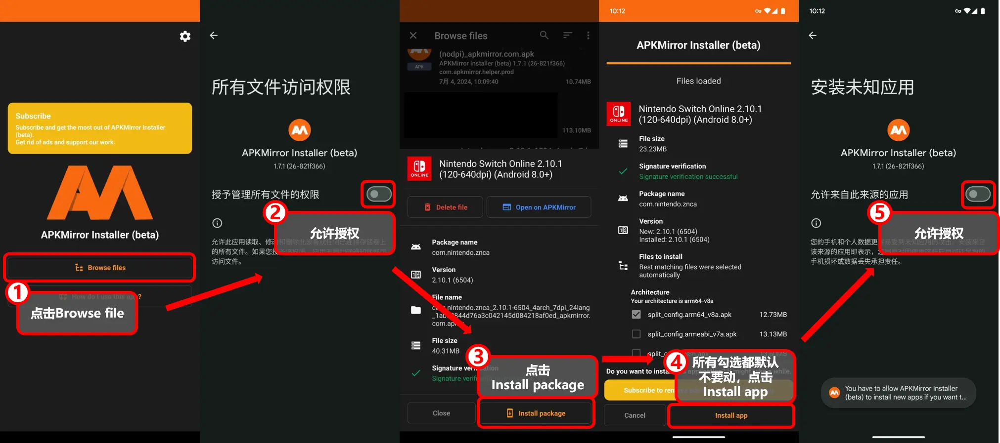

## 背景

在Android设备上安装应用，通常是通过Google Play商店或者APK文件进行安装。

而2021 年 8 月起，Google Play 要求所有新应用必须以 Android App Bundle (AAB) 格式进行发布。

很多新应用以及老应用的更新版本都是以 AAB 格式发布的，这种情况下，我们无法直接获取到 APK 文件。

AAB 文件无法直接安装到设备上。

## 解决

一些第三方渠道提供了重新打包的分发方式。

比如ApkMirror，提供了重新打包的apkm文件，ApkPure、Aptoide等则提供了重新打包的xapk文件。

这些重新打包的文件可以通过一些工具进行安装。

比如apkm文件，可以通过apkmirror的官方工具进行安装。
xapk文件，可以通过apkpure的官方工具或者Split APKs Installer等工具安装。

这里以apkm文件为例，介绍如何安装。

## 方法

### 1. 下载apkm文件

首先，从ApkMirror等渠道下载apkm文件。

### 2. 安装APKMirror Installer

下载地址：[APKMirror Installer](https://www.apkmirror.com/apk/apkmirror/apkmirror-installer-official/apkmirror-installer-official-1-7-1-26-821f366-release/)

### 3. 打开APKMirror Installer安装apkm文件

安装过程如下图：

- 1.打开APKMirror Installer，点击Browse Files
- 2.授权文件访问权限
- 3.选择刚才下载的apkm文件，点击Install Package
- 4.APKMirror Installer会根据系统默认勾选需要安装的文件，这里直接点击Install app即可
- 5.授权安装权限，等待安装完成

※ 第4步可根据自己的机型调整需要安装的文件，如果安装后出现不兼容等问题，可以尝试勾选其他文件。

## 结束

安装完成后，即可在设备上找到安装的应用。
如果嫌占用空间，可以删除下载的apkm文件以及APKMirror Installer。

